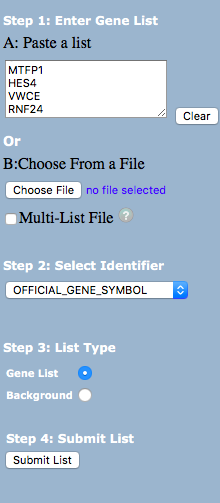
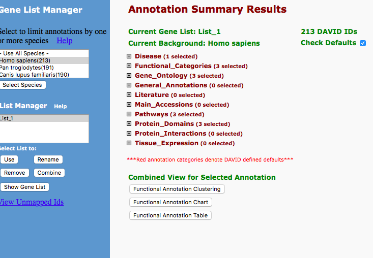
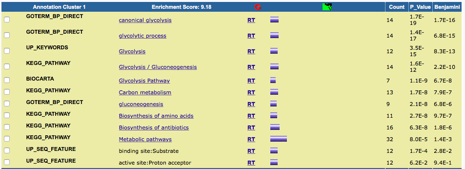

ISABEL METZGER
BIOINFORMATICS FALL 2017
LOADING EDGER

```{r}
library(limma)
library(edgeR)
library(car)
```
#Read in count table and experimental design:

```{r setup, reading text}
ovarian_df <- read.delim("GSE52695_Ovarian_RefSeq_RPKM_Values.txt",
                         row.names=1, header=T)

```
```{r}
head(ovarian_df)
```
the dataframe contains 22446 rows (genes) and a total of 12 cols (12 libraries)
```{r}
dim(ovarian_df)
```
Reordering column names
```{r}
reorder.colnames <- paste("Library", 1:12, sep="_")
```
```{r}
reorder.colnames
```

```{r}
ovarian_reordered_df <- ovarian_df[,reorder.colnames]
```
```{r}
head(ovarian_reordered_df)
```
Creating new colnames
```{r}
newcolnames <- paste("GSM12742", 53:64, sep="") #2 or more vectors pasted element for element.
```
```{r}
newcolnames
```
```{r}
library(data.table)
new_ovarian_df <- setnames(ovarian_reordered_df,
                           old=reorder.colnames, new=newcolnames)
```
```{r}
head(new_ovarian_df)
```
Genes are now row names and what is left is the counts/ expression levels. See below for the renamed columns.
```{r}
length(reorder.colnames)
length(newcolnames)
```
```{r}
treatment <- c("Normoxia_6hr (total RNA)_1", "Normoxia_6hr (total RNA)_2",
               "Hypoxia_6hr (total RNA)_3","Hypoxia_6hr (total RNA)_4","Normoxia_48hr (total RNA)_5"," Normoxia_48hr (total RNA)_6","Hypoxia_48hr (total RNA)_7",
               "Hypoxia_48hr (total RNA)_8","Normoxia_6days (total RNA)_9","Normoxia_6days (total RNA)_10","Hypoxia_6days (total RNA)_11","Hypoxia_6days (total RNA)_12")
length(treatment)
```

```{r}
keydf <- data.frame(reorder.colnames, newcolnames, treatment)
```

```{r}
keydf$treatmentsimplified <- c("Normoxia", "Normoxia", "Hypoxia", "Hypoxia","Normoxia", "Normoxia", "Hypoxia", "Hypoxia","Normoxia", "Normoxia", "Hypoxia", "Hypoxia")

```
```{r}
keydf
```

```{r}
group <- keydf$treatmentsimplified
```
```{r}
group
```
```{r}
head(new_ovarian_df)
```
```{r}
#Create DGEList object with groups for the treatments N and H

cds <- DGEList(new_ovarian_df, group = group )
dim(cds)

```

```{r}
#Filter out genes with low counts, keeping those rows where the count
#per million (cpm) is at least 1 in at least three samples:

keep <- rowSums(cpm(cds)>1) >=3
cds <- cds[keep,]
dim(cds)      			# How many genes are left?
cds <- calcNormFactors(cds)	#normalize number of reads per sample

```
```{r}
?plotMDS
```
Usage
## Default S3 method:
plotMDS(x, top = 500, labels = NULL, pch = NULL, cex = 1,
     dim.plot = c(1,2), ndim = max(dim.plot), gene.selection = "pairwise",
     xlab = NULL, ylab = NULL, plot = TRUE, ...)
## S3 method for class 'MDS'
plotMDS(x, labels = NULL, pch = NULL, cex = 1, dim.plot = NULL,
     xlab = NULL, ylab = NULL, ...)

```{r plot MDS}
				#plot the data (MDS is like PCA)
mds <- plotMDS(cds, main = "MDS Plot for Count Data", labels = colnames(cds$counts))

plot(mds, main="MDS Plot for Count Data, clear view", xlab="Leading LogFC dim1", ylab="Leading logFC dim2", col=keydf$treatment)
par(xpd=TRUE)
legend(0.75,0.2,fill=keydf$treatment,legend=keydf$treatment,cex=0.6)

#           title("Tx Status")
# library(car)
```
```{r}
cds
```

```{r}
				#estimate variance, compute diff. exp
cds <- estimateCommonDisp( cds )
cds <- estimateTagwiseDisp( cds , prior.df = 10 ) 	#shrinks variance toward common disp.
de.tgw <- exactTest( cds , pair = c( "Normoxia" , "Hypoxia" ) )	#this is the DE test
options( digits = 3 ) # print only 3 digits
topTags( de.tgw , n = 20 , sort.by = "p.value" )      # print the top 20 DE genes, by p-value
resultsTbl.tgw <- topTags( de.tgw , n = nrow( de.tgw$table ) )$table
de.genes.tgw <- rownames( resultsTbl.tgw )[ resultsTbl.tgw$FDR <= 0.05 ]
length( de.genes.tgw )		# How many genes with significant DE?
summary( decideTestsDGE( de.tgw , p.value = 0.05 ) )		# show Up and Down regulated genes
write.table(resultsTbl.tgw, file = "LiData_egeR_.csv" , sep = "," , row.names = TRUE )
```
```{r}
# xgenes <- cat(noquote(row.names(resultsTbl.tgw)), sep="\n")
```

Took list of top DE genes and used DAVID to find Gene Ontology and KEGG enriched functional groups.
Went to website: https://david.ncifcrf.gov/summary.jsp
Uploaded gene list, selected Homo sapiens:

I picked the top 225 genes, selected Homo sapiens, which narrowed the Gene List to 213 genes.

Here is an image of the process:
Explored various ways to import the URL tab delim file.





```{r}
# 
```
Current Gene List: List_1
Current Background: Homo sapiens
213 DAVID IDs
---------
Importing the functional_annotation_clustering for _Homo sapiens_
```{r}
library(readr)
library(RCurl)

  URL <-"https://david.ncifcrf.gov/data/download/t2t_0C32396F8F541508972082264.txt"

# Final_Clustering <- read.table(URL, header=FALSE, sep="\t")
```

```{r}
functional.annotaton.clustering.dat <- fread(URL, header=T)
head(functional.annotaton.clustering.dat)
```

```{r}
# functional.annotaton.clustering.dat <- read.csv(textConnection(myfile), header=F)
# head(functional.annotaton.clustering.dat)
```
Current Gene List: List_1
Current Background: Homo sapiens
213 DAVID IDs
---------
Importing the Functional Annotation Chart 
```{r}
URL2 <- "https://david.ncifcrf.gov/data/download/chart_0C32396F8F541508972594179.txt"
Functional_Annotation_Chart <- fread(URL2, header=T)
head(Functional_Annotation_Chart)
```
Functional Annotation Table
Current Gene List: List_1
Current Background: Homo sapiens
28387 DAVID IDs
------
```{r}
#importing functional annotation table
URL3 <- "https://david.ncifcrf.gov/data/download/tr_0C32396F8F541508973016208.txt"
myfile <- getURL(URL3, ssl.verifyhost=FALSE, ssl.verifypeer=FALSE)
Functional_Annotation_Table <- read.delim(textConnection(myfile), header=T, sep = "\t")
```
```{r}
head(Functional_Annotation_Table)
```


